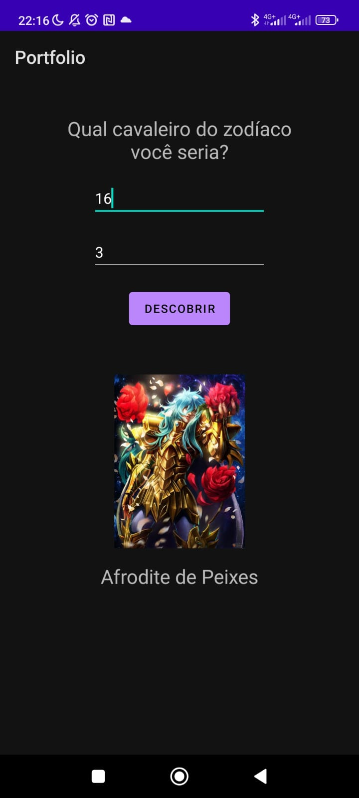
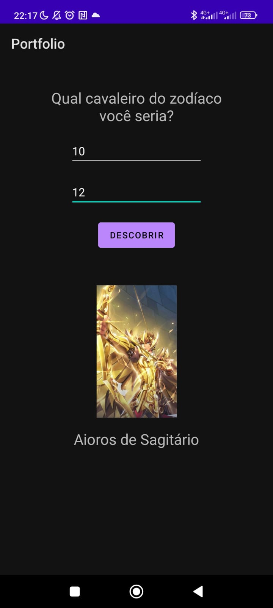

#♑ | CDZAPP

CDZAPP é um projeto avaliativo desenvolvivo durante um periódo de tempo determinado para qualificar nossas habilidades e aprimoramentos com o Android Studio e suas aplicações. Baseado no desenho Cavaleiro dos Zodiacos o usuario 

## ⚙️ | Funcionamento

 Baseado no anime Cavaleiros do Zodiaco o usuario ira inserir a data desejada e desvendará qual personagem está vinculada a tal evento e o software exibirar o nome e personagem desejado 

## 🖼️ | Imagem do aplicativo

  

